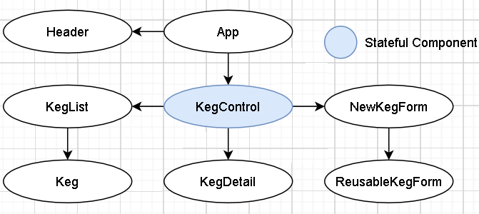

# _Tap-Room_

    

  <small>Last Updated: February 12th, 2021</small>

#### _Building an app to track Keg inventory_ 

# 🧑‍💻 Contributers

| Name | GitHub Profile |
|------|----------------|
|[Jerrod Styrk](https://www.linkedin.com/in/styrk-jerrodm/)|[SJerrod](https://github.com/SJerrod)|

# 📖 Description
- This application when run will show a list of available beers, If none are availible or if you wish to add to the list click the "Add New Beer" button. Click on a beer in the beer list to expand its details. Users can buy, restock and delet beers from list.

# 💾 Installation Requirements

Software Requirements
* An internet browser of your choice; I prefer Chrome
* A code editor; I prefer VSCode

# 🖥️ Opening the Project on your Local System

Open by Downloading or Cloning
- [Click to view Github repository](https://github.com/SJerrod/tap-room.git) Or simply paste the following url into your prefered browser https://github.com/SJerrod/tap-room.git
- To Clone repository simply click the green Code button and copy the url.
- Using a prefered terminal use the command `git clone paste-url-here` in which ever directory you wish.
- Open the newly cloned repo with your text editor.
- In the terminal run command `cd tap-room` if you are not already at the root directory
- In the terminal run command `npm install` in install dependencies and webpacks
- In the terminal run command `npm start` to start the app in browser
  Runs the app in the development mode.\
  Open [http://localhost:3000](http://localhost:3000) to view it in the browser.

  The page will reload if you make edits.\
  You will also see any lint errors in the console.

# 🛰️ Component Diagram

# 🦠 Bugs / Issues

* None currently to note

# ☎️ Support / Contact Details

* Please feel free to reach out to <jstyrk@citadel.edu>

# ⚙️ Technologies Used

  
Expand Tech/tools

* [VSCode](https://code.visualstudio.com/)
* [Git](https://git-scm.com/)
* [JavaScriptES6](https://www.javascript.com/)
* [JSX](https://reactjs.org/docs/introducing-jsx.html)
* [React](https://reactjs.org/)
* [Create React App documentation](https://facebook.github.io/create-react-app/docs/getting-started)
* [node.js](https://nodejs.org/en/)
* [Bootstrap](https://create-react-app.dev/docs/adding-bootstrap/)
* [Webpack](https://webpack.js.org/)
* [Babel](https://babeljs.io/)
* [Eslint](https://eslint.org/)

# ⚖️ License & Copyright

Copyright (c) 2020 **_Jerrod Styrk_**